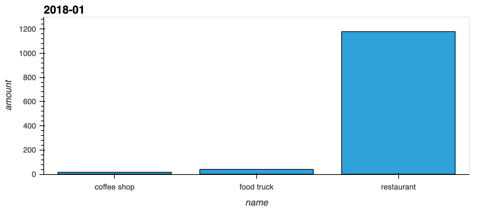
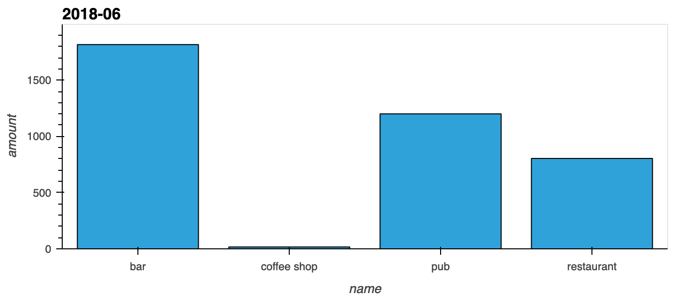

# Looking for Suspicious Transactions

## Data Modeling

I used the following input on [Quick Database Diagrams](https://www.quickdatabasediagrams.com/):
```card_holder
-
id int pk
name varchar(20)

credit_card
-
card varchar(20) pk
cardholder_id int fk >- card_holder.id

merchant_category
-
id smallint pk
name varchar(20)

merchant
-
id int pk
name varchar(50)
id_merchant_category smallint fk >- merchant_category.id

transaction
-
id int pk
date timestamp
amount float
card varchar(20) fk >- credit_card.card
id_merchant int fk >- merchant.id
```

The resulting entity relationship diagram (ERD) is:


## Data Analysis

### Part 1
Here are transactions less than $2 for different card holders. 

|transactions less than $2|name             |
|-------------------------|-----------------|
|3                        |Elizabeth Sawyer |
|19                       |Malik Carlson    |
|21                       |Brandon Pineda   |
|16                       |Nancy Contreras  |
|16                       |Mark Lewis       |
|14                       |Sara Cooper      |
|11                       |Shane Shaffer    |
|3                        |Laurie Gibbs     |
|19                       |John Martin      |
|19                       |Crystal Clark    |
|4                        |Dana Washington  |
|18                       |Sean Taylor      |
|15                       |Michael Floyd    |
|16                       |Danielle Green   |
|22                       |Stephanie Dalton |
|7                        |Austin Johnson   |
|26                       |Megan Price      |
|6                        |Beth Hernandez   |
|10                       |Robert Johnson   |
|20                       |Matthew Gutierrez|
|4                        |Michael Carroll  |
|18                       |Kevin Spencer    |
|22                       |Peter Mckay      |
|9                        |Gary Jacobs      |
|12                       |Kyle Tucker      |

Here are transactions less than $2 for different cards. 

|transactions less than $2|card               |
|-------------------------|-------------------|
|5                        |4027907156459098   |
|7                        |501809222273       |
|8                        |5500708021555307   |
|8                        |3561072557118696   |
|3                        |30078299053512     |
|4                        |3535651398328201   |
|9                        |4962915017023706562|
|7                        |3517111172421930   |
|9                        |5175947111814778   |
|7                        |4586962917519654607|
|6                        |675911140852       |
|8                        |501879657465       |
|7                        |4741042733274      |
|9                        |503842928916       |
|9                        |4268491956169254   |
|3                        |4761049645711555811|
|4                        |4159836738768855913|
|6                        |6500236164848279   |
|6                        |4188164051171486   |
|4                        |30142966699187     |
|2                        |3581345943543942   |
|8                        |4498002758300      |
|13                       |376027549341849    |
|10                       |4743204091443101526|
|5                        |213193946980303    |
|5                        |4276466390111      |
|11                       |344119623920892    |
|11                       |180098539019105    |
|6                        |5135837688671496   |
|9                        |3561954487988605   |
|5                        |4644008655884311378|
|4                        |4279104135293225293|
|9                        |3582198969197591   |
|9                        |372414832802279    |
|12                       |584226564303       |
|10                       |3516952396080247   |
|4                        |6011987562414062   |
|3                        |30181963913340     |
|9                        |30063281385429     |
|8                        |4539990688484983   |
|6                        |4723783028106084756|
|3                        |4150721559116778   |
|7                        |4319653513507      |
|4                        |4263694062533017   |
|4                        |4711773125020499   |
|5                        |4866761290278198714|
|9                        |4681896441519      |
|7                        |4506405265172173   |
|6                        |4834483169177062   |
|4                        |5361779664174555   |
|6                        |4165305432349489280|
|5                        |5297187379298983   |
|2                        |5570600642865857   |

There does not seem to be an anomaly in those transactions. 

Here are the top 100 transactions between 7 am and 9 am:

|amount            |date               |
|------------------|-------------------|
|1617.0000000000002|2018-03-05 08:26:08|
|1131              |2018-01-22 08:07:03|
|1060              |2018-09-26 08:48:40|
|1017              |2018-09-06 08:28:55|
|748               |2018-12-14 08:51:41|
|20.44             |2018-10-07 08:16:54|
|19.5              |2018-03-03 08:42:02|
|19.49             |2018-06-04 08:30:28|
|19.34             |2018-03-26 08:08:27|
|19.33             |2018-06-01 08:56:59|
|18.98             |2018-02-21 08:21:10|
|18.93             |2018-07-04 08:51:29|
|18.72             |2018-01-06 08:42:50|
|18.54             |2018-08-14 08:38:49|
|18.52             |2018-02-27 08:27:00|
|18.3              |2018-02-18 08:54:19|
|17.85             |2018-02-05 08:37:24|
|17.78             |2018-04-15 08:32:38|
|17.56             |2018-06-13 08:46:29|
|17.54             |2018-01-18 08:18:50|
|17.53             |2018-01-18 08:58:13|
|17.48             |2018-05-20 08:36:46|
|17.36             |2018-01-16 08:02:04|
|16.65             |2018-04-23 08:18:49|
|16.35             |2018-12-16 08:41:53|
|16.28             |2018-01-06 08:49:34|
|16.21             |2018-07-17 08:10:36|
|16.07             |2018-04-11 08:26:52|
|15.98             |2018-09-06 08:35:35|
|15.94             |2018-06-26 08:00:22|
|15.15             |2018-01-27 08:36:58|
|15.1              |2018-02-25 08:23:37|
|15.05             |2018-06-10 08:20:40|
|15.04             |2018-04-20 08:27:59|
|14.36             |2018-12-15 08:34:15|
|13.53             |2018-03-10 08:52:09|
|13.52             |2018-04-27 08:08:38|
|12.98             |2018-10-27 08:04:44|
|12.96             |2018-03-30 08:12:28|
|12.52             |2018-08-08 08:36:23|
|12.5              |2018-07-30 08:49:16|
|12.32             |2018-11-30 08:52:20|
|12.25             |2018-12-29 08:11:55|
|12.17             |2018-02-19 08:50:36|
|11.96             |2018-01-20 08:35:34|
|11.87             |2018-12-31 08:22:17|
|11.86             |2018-08-30 08:46:49|
|11.72             |2018-09-15 08:33:49|
|11.65             |2018-05-04 08:21:59|
|11.64             |2018-11-04 08:34:16|
|11.55             |2018-03-12 08:57:11|
|11.37             |2018-10-20 08:13:44|
|11.37             |2018-08-16 08:15:42|
|11.35             |2018-01-25 08:58:28|
|11.08             |2018-10-27 08:17:07|
|10.97             |2018-10-03 08:32:36|
|10.85             |2018-10-09 08:15:25|
|10.82             |2018-04-14 08:09:42|
|10.53             |2018-03-30 08:28:18|
|10.5              |2018-11-03 08:54:52|
|10.47             |2018-01-23 08:07:03|
|10.45             |2018-07-18 08:04:03|
|10.36             |2018-03-17 08:07:52|
|10.28             |2018-05-30 08:53:40|
|10.27             |2018-09-21 08:28:34|
|10.26             |2018-03-19 08:40:24|
|10.26             |2018-02-01 08:49:24|
|10.24             |2018-04-19 08:09:45|
|10.24             |2018-05-22 08:49:19|
|10.23             |2018-07-10 08:29:26|
|10.21             |2018-07-15 08:56:47|
|10.2              |2018-10-22 08:11:43|
|10.06             |2018-08-19 08:23:11|
|10.03             |2018-04-12 08:33:16|
|10                |2018-02-16 08:32:50|
|9.59              |2018-12-15 08:05:20|
|8.32              |2018-09-20 08:41:00|
|8.02              |2018-02-18 08:19:55|
|7.8               |2018-11-20 08:31:45|
|7.73              |2018-09-23 08:15:35|
|6.68              |2018-06-27 08:22:41|
|6.46              |2018-11-25 08:31:16|
|6.4               |2018-06-30 08:01:12|
|6.36              |2018-08-17 08:25:22|
|6.23              |2018-06-18 08:04:04|
|6.2               |2018-03-26 08:14:09|
|6.17              |2018-02-14 08:06:06|
|6.06              |2018-05-14 08:19:34|
|5.96              |2018-12-24 08:12:44|
|5.94              |2018-08-28 08:40:01|
|5.92              |2018-08-05 08:11:21|
|5.59              |2018-10-07 08:21:09|
|5.55              |2018-05-16 08:50:23|
|5.5               |2018-07-02 08:25:29|
|5.17              |2018-03-25 08:27:43|
|5.05              |2018-12-16 08:22:39|
|5                 |2018-01-24 08:28:08|
|4.98              |2018-03-22 08:20:15|
|4.74              |2018-11-09 08:29:42|
|4.6               |2018-06-05 08:19:20|

Here are the top 100 transactions at other times. 

|amount            |date               |
|------------------|-------------------|
|2249              |2018-12-13 15:51:59|
|2108              |2018-04-21 19:41:51|
|2001.0000000000002|2018-09-02 06:17:00|
|1911              |2018-11-13 17:07:25|
|1901.0000000000002|2018-05-08 13:21:01|
|1855.9999999999998|2018-09-11 15:16:47|
|1839              |2018-02-19 22:48:25|
|1814              |2018-06-03 20:02:28|
|1813              |2018-06-22 06:16:50|
|1803              |2018-07-26 23:02:51|
|1802              |2018-11-27 15:36:05|
|1795              |2018-06-10 04:54:27|
|1789.9999999999998|2018-09-04 01:35:39|
|1769.0000000000002|2018-11-17 05:30:43|
|1723.9999999999998|2018-12-19 16:10:03|
|1691              |2018-01-24 13:17:19|
|1685.0000000000002|2018-01-04 03:05:18|
|1678              |2018-01-23 06:29:37|
|1660.0000000000002|2018-11-27 17:27:34|
|1634              |2018-12-24 15:55:06|
|1592              |2018-06-27 01:27:09|
|1534              |2018-03-04 15:50:53|
|1530              |2018-03-12 00:44:01|
|1449              |2018-08-07 11:07:32|
|1430              |2018-02-17 01:27:19|
|1398              |2018-07-03 14:56:36|
|1379              |2018-08-05 01:06:38|
|1302              |2018-07-31 05:15:17|
|1296              |2018-12-18 17:20:33|
|1279              |2018-11-27 17:20:29|
|1203              |2018-05-29 02:55:08|
|1179              |2018-10-07 18:29:20|
|1177              |2018-01-30 18:31:00|
|1176              |2018-09-10 22:49:41|
|1162              |2018-06-04 03:46:15|
|1160              |2018-07-14 06:09:18|
|1159              |2018-07-11 16:55:22|
|1154              |2018-12-13 12:09:58|
|1145              |2018-02-27 15:27:32|
|1123              |2018-11-25 20:44:07|
|1119              |2018-03-01 21:29:05|
|1108              |2018-06-28 21:13:52|
|1108              |2018-07-24 22:42:00|
|1103              |2018-06-17 15:59:45|
|1102              |2018-06-21 13:16:25|
|1095              |2018-09-25 23:23:21|
|1086              |2018-04-18 23:23:29|
|1077              |2018-04-03 03:23:37|
|1075              |2018-09-23 19:20:23|
|1074              |2018-12-18 13:33:37|
|1072              |2018-02-19 16:00:43|
|1063              |2018-04-08 06:03:50|
|1056              |2018-09-06 21:55:02|
|1054              |2018-11-20 05:24:28|
|1053              |2018-10-19 01:07:37|
|1046              |2018-05-13 06:31:20|
|1035              |2018-12-25 19:10:42|
|1033              |2018-12-30 23:23:09|
|1031              |2018-01-02 23:27:46|
|1029              |2018-01-08 02:34:32|
|1014              |2018-12-03 02:38:52|
|1011              |2018-03-20 13:05:54|
|1001              |2018-08-16 10:01:00|
|852               |2018-03-20 10:19:25|
|757               |2018-10-07 14:40:34|
|749               |2018-06-06 21:50:17|
|691               |2018-06-17 02:45:49|
|626               |2018-09-09 03:39:06|
|543               |2018-04-10 06:08:01|
|525               |2018-04-21 18:40:47|
|484               |2018-10-16 13:27:33|
|466               |2018-11-13 05:58:47|
|458               |2018-09-02 11:20:42|
|445               |2018-02-09 11:38:37|
|393               |2018-10-23 22:47:13|
|389               |2018-03-09 04:51:38|
|333               |2018-01-08 11:15:36|
|325               |2018-04-11 02:50:37|
|313               |2018-12-28 16:20:31|
|291               |2018-07-21 11:08:39|
|283               |2018-04-09 10:24:32|
|269               |2018-04-09 18:28:25|
|267               |2018-11-26 20:54:39|
|267               |2018-07-13 19:47:49|
|258               |2018-06-18 23:05:30|
|245.00000000000003|2018-05-30 12:34:04|
|233               |2018-07-17 10:11:12|
|229               |2018-01-11 13:20:31|
|206               |2018-10-11 23:29:33|
|188               |2018-08-21 20:46:33|
|178               |2018-10-19 12:32:37|
|175               |2018-01-07 01:10:54|
|160               |2018-05-19 19:33:38|
|137               |2018-10-28 02:12:58|
|121               |2018-06-30 01:56:19|
|117               |2018-07-06 16:12:08|
|89                |2018-07-04 17:28:06|
|56.99999999999999 |2018-12-05 19:24:27|
|23.04             |2018-11-22 20:42:00|
|22.78             |2018-11-08 02:10:03|

There does not seem to be an anomaly in transactions between 7 am and 9 am compared with other times. 

The sql file for the table schemata and queries is [creditcards.sql](./creditcards.sql).

### Part 2

The following plot shows the transaction history for card holders 2 and 18:


Card holder 2's transaction history looks normal. All the transactions are with $20. However, card holder 18's transaction history shows many spikes with large amount of consumptions. It is very like cardholder ID 18's card was hacked. 

The following plots shows expenditure data from January 2018 to June 2018 for cardholder ID 25:





It is quite clear cardholder ID 25 spent a lot of money on expensive restaurant bills.